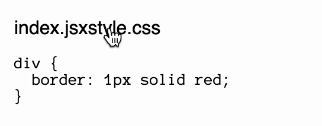

# remark-code-tabs

## What

It's a remark plugin which create the basics for code tabs in a markdown document.

## Demo

````md
```jsx tabs=demo name=index.jsx
export default function App() {
  return <div>hello world</div>;
}
```

```css tabs=demo name=style.css
div {
  border: 1px solid red;
}
```
````

↓



## When

When you wont't use docusaurus' plugin because you don't want/plan to add jsx/mdx.

## How

### Installation

1. Install the plugin with `npm i remark-code-tabs`
2. Import the plugin with `import remarkCodeTabs from 'remark-plugin-code-tabs'
3. Add to your remark plugin stack `[remarkCodeTabs]`

### Usage

In a markdown file, add the 2 meta `tabs="" name=""` to a block content such as:

````md
```jsx tabs="demo" name="index.jsx"
export default function App() {
  return <div>hello world</div>;
}
```

```css tabs="demo" name="style.css"
div {
  border: 1px solid red;
}
```
````

### Styling

By default, no style will be injected, only classnames and a default html structure to help you get started. That said, you can import the plugin like this `[remarkCodeTabs, { injectStyle: true }]` to add a inlined `<style>` with the bare minimum to have a tab-like navigation, or `[remarkCodeTabs, { injectStyle: 'cdn' }]` yielding a link tag using unpkg.com.

You can leverage these css selectors to theme your code tabs:

```css
.remark-code-tabs {
  /* tabs wrapper */
}

.remark-code-tab {
  /* tab default state */
}

.remark-code-tab:has(:checked) {
  /* tab active state */
}

.remark-code-tab:not(:has(:checked)) {
  /* tab inactive state */
}

.remark-code-content {
  /* content wrapper */
}
```
